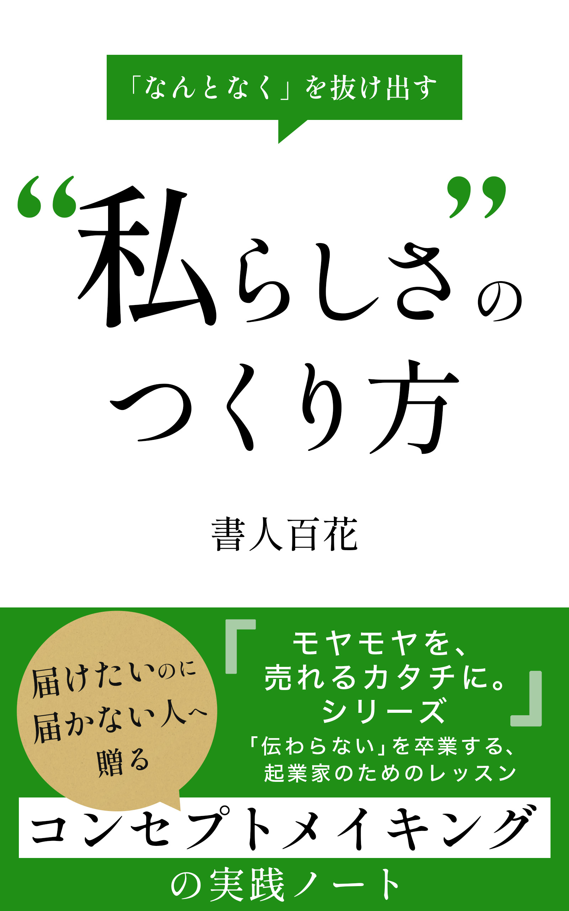

<!DOCTYPE html>
<html lang="ja" data-theme="light">
<head>
    <meta charset="UTF-8">
    <meta name="viewport" content="width=device-width, initial-scale=1.0">
    <title>コンセプトメイキング完全解説マニュアル</title>
    <!-- Pico.css -->
    <link rel="stylesheet" href="https://cdn.jsdelivr.net/npm/@picocss/pico@1/css/pico.min.css">
    <!-- Google Fonts -->
    <link href="https://fonts.googleapis.com/css2?family=Shippori+Mincho:wght@400;500;700&display=swap" rel="stylesheet">
    
</head>
<body>

    <!-- ■ 表紙（画像） ■ -->
    <section class="cover-page">
        
    </section>

    <!-- ■ はじめに ■ -->
    <section>
        <h1 class="chapter-heading">はじめに： なぜ、今コンセプトメイキングなのか？</h1>

        <h3>このマニュアルを手にした「あなた」へ（私からのメッセージ）</h3>
        
こんにちは。この「コンセプトメイキング完全解説マニュアル」を手に取ってくださり、本当にありがとうございます。この出会いに、まずは感謝させてください。

        
今、あなたの手元にあるこの一冊は、単なるノウハウ集ではありません。これは、私自身がビジネスの現場で悩み、もがき、そして見つけ出した「売れる仕組みの核心」へと至る思考の旅路を、あなたと共有したいという想いを込めて書き記したものです。

        
もしかしたらあなたは今、新しいビジネスのアイデアに胸を膨らませているかもしれません。あるいは、愛情を込めて育ててきた事業を、もっと多くの人に知ってもらい、次のステージへと押し上げたいと願っているかもしれませんね。もしかすると、「こんなに頑張っているのに、なぜか成果が出ない…」そんな壁に直面し、突破口を探している最中かもしれません。

        
どのような状況であれ、きっとあなたは、真剣にビジネスと向き合い、より良い未来を切り拓こうとされているはずです。その熱意と行動力に、私は心からの敬意を表します。

        <h3>私も深くハマった「頑張っているのに報われない」迷宮</h3>
        
少し、私の話をさせてください。今でこそ、コンセプトの重要性について語る立場にありますが、かつての私は、まさに「頑張っているのに報われない」迷宮のど真ん中でもがいていました。

        

            
「これだけ高品質な製品を作ったんだ。絶対に顧客は価値を分かってくれるはずだ」 
            「競合よりも優れたサービスを提供している。黙っていても選ばれるに違いない」

        

        
そんな風に、自社の提供するものへの自信だけを頼りに、市場へと乗り込んでいきました。寝る時間を削り、持てる力のすべてを注ぎ込んだプロジェクトもありました。しかし、現実は甘くありませんでした。鳴かず飛ばず、という言葉がまさにぴったりな状況が続いたのです。顧客からの反応は鈍く、売上は伸び悩み、焦りと不安だけが募っていく日々…。

        
なぜだ？ 何が足りないんだ？ 自問自答を繰り返す中で、ある一つのシンプルな、しかし決定的な事実に気づかされたのです。それは、「自分が届けたい価値」と「顧客が本当に求めている価値」の間に、深い溝があったということ。そして、その溝を埋めるための「羅針盤」を持っていなかったということでした。

        
その羅針盤こそが、「コンセプト」だったのです。

        <h3>時代が変わっても色褪せない「ビジネスの原点」</h3>
        
世の中は、息つく暇もないほどのスピードで変化しています。新しい技術が生まれ、人々の価値観も多様化し、ビジネスを取り巻く環境は複雑さを増すばかりです。

        
しかし、どれだけ時代が移り変わろうとも、ビジネスが成り立つ上での「原点」は、決して揺らぐことはありません。それは、<strong>「誰かの困りごとや願いを見つけ出し、それを解決することで、より良い状態へと導くこと」</strong>。ただ、それだけなのです。

        
コンセプトメイキングとは、このビジネスの原点に立ち返り、「自社は、誰の、どんな課題を解決し、どんな未来を提供する存在なのか？」という根本的な問いに、明確な答えを与えるプロセスです。それは、単にお洒落なキャッチコピーを考えたり、目先の売上を追うための小手先のテクニックではありません。自社の存在意義そのものを深く掘り下げ、顧客との間に、一時的な関係ではない、深く、永続的な繋がりを築くための、いわば「魂を込める作業」なのです。

        <h3>このマニュアルが、あなたの「武器」になるために</h3>
        
このマニュアルでは、コンセプトメイキングという、一見すると捉えどころのないテーマを、具体的なステップと、現場で即使える思考法に分解してお伝えしていきます。私が経験した失敗や、そこから学んだ教訓も、包み隠さずお話しするつもりです。

        
読み進めるうちに、あなたはきっと、

        <ul>
            <li>価格競争や品質至上主義の「本当の危うさ」を理解し、</li>
            <li>顧客の心の奥底にある「真の欲求」を読み解く視点を手に入れ、</li>
            <li>数多ある競合の中で、自社が「選ばれるべき理由」を明確に言語化し、</li>
            <li>顧客の心を揺さぶり、行動を促す「響くメッセージ」を紡ぎ出し、</li>
        </ul>
        
そして何より、自信を持って自社の価値を世に問い、ビジネスをドライブさせるための「揺るぎない軸」を、ご自身の中に打ち立てることができるはずです。

        
このマニュアルが、あなたのビジネスにとって、強力な「武器」となり、未来を切り拓くための一助となることを、心から願っています。

        
さあ、準備はよろしいでしょうか？ 共に、コンセプトメイキングという刺激的な冒険へと、出発しましょう。

    </section>

    <!-- ■ 目次 ■ -->
    <section>
        <h1 class="chapter-heading">目次</h1>
        <ul class="toc-list">
            <li>はじめに なぜ、今コンセプトメイキングなのか？</li>
            <li>第1章 幻想から目を覚ます</li>
            <li>第2章 コンセプトの本質 ～顧客は何を買っているのか？～</li>
            <li>第3章 すべての始まりは「顧客理解」から</li>
            <li>第4章 売れるコンセプトの源泉「顧客の問題」を発掘する</li>
            <li>第5章 響く価値提案「ベネフィット」を定義する</li>
            <li>第6章 「本当に効くの？」信頼を勝ち取る方法</li>
            <li>第7章 コンセプトを魅力的に見せる「パッケージング」</li>
            <li>第8章 競合の中で輝く「ポジショニング」戦略</li>
            <li>第9章 「あなたから買いたい」を生み出す「差別化」戦略</li>
            <li>第10章 アイデアに詰まった時の処方箋</li>
            <li>おわりに コンセプトは磨き続けるもの</li>
        </ul>
    </section>

    <!-- ■ 第1章 ■ -->
    <section>
        <h1 class="chapter-heading">第1章 「安ければ売れる」「良いモノなら売れる」という幻想から目を覚ます</h1>
        
ビジネスの世界に足を踏み入れるとき、あるいは新しい挑戦を始めるとき、私たちの思考はしばしば、シンプルで分かりやすい「正解」を求めがちです。特に、「価格」と「品質」は、その代表格と言えるでしょう。

        
「他よりも価格を抑えれば、顧客は賢い選択をしてくれるはずだ」 「どこにも負けない品質を実現すれば、その価値は自ずと伝わるだろう」

        
こうした考え方は、努力の方向性を示してくれるという意味では、ある種の安心感を与えてくれるかもしれません。しかし、残念ながら、現代の複雑化した市場において、この二つの要素だけを頼りに航海に出ることは、羅針盤を持たずに嵐の海へ漕ぎ出すようなものなのです。なぜなら、そこには多くの企業が陥りがちな、深い「幻想」が潜んでいるからです。この章では、まずその幻想から目を覚ますことから始めましょう。

        <h2>価格競争という名の底なし沼 ～消耗戦の先に待つもの～</h2>
        
「少しでも安く提供する」。これは、最も手軽に実行できる競争戦略のように見えます。しかし、その手軽さゆえに、多くの企業が足を踏み入れ、そして抜け出せなくなる「底なし沼」でもあります。

        
想像してみてください。もし、あなたの提供する価値が「安さ」だけだとしたら…？ 競合がほんの少しでも安い価格を打ち出してきた瞬間、これまであなたの元にいた顧客は、まるで潮が引くように、あっさりと離れていってしまうでしょう。価格だけで繋がっていた関係は、それほど脆いものなのです。

        
そうなれば、あなたは更なる値下げで対抗するしかありません。しかし、それは自らの首を絞める行為に他なりません。利益は削られ、事業を維持・成長させるための体力はどんどん奪われていきます。新しい商品開発への投資も、共に働く仲間への還元も、そして顧客へのより良いサービス提供も、すべてが困難になっていくのです。

        
安さを維持するために、品質を犠牲にしたり、サポート体制を縮小したり… そうした苦肉の策が、さらなる顧客離れを招く。そんな負のスパイラルに陥ってしまった企業を、私はいくつも見てきました。

        
もちろん、ビジネスモデルによっては価格戦略が有効なケースもあります。例えば、圧倒的な生産効率や仕入れルートを持つ一部の大企業のように。しかし、あなたが独自の価値で勝負しようと考えているならば、安易な価格競争という名の消耗戦からは、一刻も早く距離を置くべきなのです。

        <h2>「最高の品質」が必ずしも「最高の選択」にならない現実</h2>
        
「価格で勝負しないなら、品質で圧倒すればいい」。そう考える方も多いでしょう。確かに、高品質なものを提供することは、顧客の信頼を得て、長期的な関係を築く上で、絶対に欠かせない土台です。品質へのこだわりは、作り手としての誇りでもあるはずです。

        
しかし、ここで立ち止まって考えてほしいのです。「品質が高いこと」が、そのまま「売れること」に直結するとは限らない、という厳然たる事実について。

        
なぜでしょうか？

        
        <h3>作り手と顧客のギャップ</h3>
        
まず、作り手が信じる「最高」と、顧客が求める「最適」の間には、しばしばギャップが存在します。

        
例えば、あるカメラメーカーが、プロのフォトグラファーも唸るほどの超高画質と多機能性を詰め込んだ最新モデルを開発したとしましょう。技術の粋を集めた、まさに「最高の品質」です。しかし、そのカメラの主なターゲットが、日常のスナップ写真を手軽に楽しみたい一般ユーザーだったとしたら？ 彼らにとって、そのプロ仕様の性能は、むしろ「複雑で使いこなせない」「重くて持ち運びにくい」「価格が高すぎる」といったネガティブな要素になりかねません。作り手の情熱が生んだ「最高」が、顧客にとっては「最適」ではなかったのです。

        <h3>品質の差は伝わりにくい</h3>
        
次に、品質の差は、想像以上に伝わりにくいという現実があります。

        
あなたは、隣り合う二つのオーガニック野菜の、栽培方法や栄養価の微細な違いを正確に見分けることができるでしょうか？ 多くの消費者にとって、製品やサービスの専門的な品質差を理解し、比較検討することは、時間的にも知識的にも困難です。結果として、「なんとなく良さそう」「デザインが好き」「あの人が薦めていたから」といった、品質以外の、より分かりやすい要素が選択の決め手になることが少なくありません。

        <h3>品質は「前提条件」</h3>
        
そして、多くの市場において、品質はもはや「差別化」ではなく「前提条件」になっているという側面もあります。

        
スマートフォンを例にとれば、今やどのメーカーの製品もある程度の品質基準を満たしています。通話ができる、インターネットに繋がる、綺麗な写真が撮れる… これらは特別なことではなく、当たり前の機能です。もちろん細かな性能差はありますが、品質が良いこと自体が、他社製品ではなく「あなたの製品を選ぶ理由」にはなりにくくなっているのです。

        <h3>品質信仰という名の「自己満足」に陥らないために</h3>
        
私が出会ったある技術系の企業の社長は、自社製品の技術的な優位性に絶対的な自信を持っていました。「この技術の凄さが分からないなんて、顧客は見る目がない」とさえ口にすることもありました。しかし、彼の会社は長年、売上の低迷に苦しんでいました。

        
彼は、自社の技術という「内側」ばかりを見て、顧客がその技術を通して「何を得たいのか」という「外側」を見ることを忘れてしまっていたのです。どんなに優れた技術も、それが顧客の抱える問題の解決や、満たされない欲求の充足に繋がらなければ、それはただの「技術のための技術」、いわば「自己満足」に過ぎません。

        <h2>「価値」で選ばれる存在へ ～思考の転換～</h2>
        
価格競争の消耗戦からも、品質至上主義の自己満足からも脱却するために、私たちに必要なのは、思考の根本的な転換です。

        
安さや品質といった「製品中心」の発想から、顧客が抱える問題や欲求、そしてそれらを解決した先にある理想の未来といった「顧客中心」の発想へとシフトすること。

        
自社の商品やサービスが、単なる「モノ」や「機能」ではなく、顧客にとって「どんな意味を持ち、どんな価値を提供できるのか？」を深く問い直し、それを明確な言葉で定義すること。

        
それこそが、コンセプトメイキングの出発点であり、顧客から真に選ばれ、愛されるビジネスを築くための、唯一無二の道なのです。

        
さあ、次の章からは、顧客が心の奥底で本当に求めているものは何か、その「価値」の正体を探る旅へと進んでいきましょう。

    </section>

    <!-- ■ 第2章 ■ -->
    <section>
        <h1 class="chapter-heading">第2章 コンセプトの本質 ～顧客は何を買っているのか？～</h1>
        
さて、第1章では、「安さ」や「品質」だけを追い求めても、真に顧客に選ばれる存在にはなれない、という少し厳しい現実についてお話ししました。価格競争の消耗戦や、品質への過信という「幻想」から目を覚まし、私たちは今、新しい視点を持つためのスタートラインに立っています。

        
では、顧客は一体、「何」を基準に商品やサービスを選び、そして購入に至るのでしょうか？ その答えを探る鍵は、私たちが普段「売っている」と思っているモノやサービスの「表面」ではなく、その奥深くにある顧客の「内面」、つまり彼らの欲求や願望、そして解決したい問題に目を向けることにあります。

        
この章では、コンセプトメイキングの核心に迫ります。顧客が本当に「買っている」ものは何なのか？ その本質を理解することが、あなたのビジネスを根底から変える力になるはずです。

        <h2>商品は、目的を達成するための「道具」でしかない？</h2>
        
少し考えてみてください。あなたが何かを購入するとき、その「モノ」自体が最終目的であることは、実はそれほど多くないのではないでしょうか？

        
例えば、あなたが最新のスマートフォンを手に入れたいと思ったとします。その動機は、「美しいデザインのデバイスを持ちたい」という所有欲かもしれません。あるいは、「高性能なカメラで、大切な瞬間を綺麗に残したい」という願望かもしれません。「友人とのコミュニケーションをもっと円滑にしたい」「仕事の効率を上げたい」という具体的な目的があるかもしれませんね。

        
いずれにしても、スマートフォンという「モノ」は、あなたが達成したい何らかの「目的」を実現するための「手段」、あるいは「道具」としての役割を果たしているに過ぎないのです。私たちは無意識のうちに、その道具がもたらしてくれる「結果」や「体験」に価値を感じ、対価を支払っているのです。

        <h2>「ドリルを買いに来た人が、本当に欲しいのは『穴』である」</h2>
        
マーケティングの世界には、古くから語り継がれている有名な言葉があります。セオドア・レビットという経済学者が提唱した、「ドリルを買いに来た人が、本当に欲しいのはドリルではなく『穴』である」という考え方です。

        
この言葉は、あまりにも的確に本質を突いているため、様々な場面で引用されてきました。しかし、その本当の意味を、私たちはどれだけ深く理解できているでしょうか？

        

            
想像してみてください。ホームセンターの工具売り場で、真剣な眼差しでドリルを選んでいる男性がいます。彼は、ただドリルという機械が欲しいのでしょうか？ おそらく違いますよね。彼が求めているのは、そのドリルを使って壁に「穴を開ける」という「結果」です。

            
しかし、話はここで終わりません。なぜ、彼は穴を開けたいのでしょうか？ もしかしたら、新しい本棚を取り付けるためかもしれません。その本棚には、これから読むであろう未知の世界が詰まった本や、家族との思い出の写真が飾られるのかもしれません。つまり、彼が本当に欲しかったのは、単なる物理的な「穴」ですらなく、本棚を設置することで生まれる「整理された快適な空間」であり、そこに本や写真を飾ることで得られる「知的な満足感」や「家族への愛情表現」といった、より高次元の価値なのかもしれないのです。

        

        
冷たい金属の塊であるドリルそのものではなく、壁に美しい円を描き、お気に入りの絵や思い出の品を飾ることで、日々の暮らしに彩りや温もりを加える… そんな、ささやかだけれど心満たされる未来の瞬間を、顧客は無意識のうちに「買っている」のかもしれません。

        <h2>「モノ」ではなく、「役割（素敵な変化・未来）」を売るということ</h2>
        
この「ドリルと穴」の話が示すように、顧客は商品やサービスそのものを買っているのではありません。彼らが買っているのは、その商品やサービスが自分の人生にもたらしてくれる「素敵な変化」であり、その先にある「より良い未来」なのです。

        
言い換えれば、あなたの提供する商品やサービスは、顧客の人生という舞台において、何らかの「役割」を果たしている、と考えることができます。

        

            <strong>商品が果たす役割の例</strong>
            <ul>
                <li>面倒な作業から解放し、自由な時間を生み出す役割</li>
                <li>自信がなく不安な気持ちを、前向きで堂々とした気持ちに変える役割</li>
                <li>孤独を感じている人に、温かな繋がりやコミュニティを提供する役割</li>
                <li>健康への不安を解消し、活動的で安心な毎日をサポートする役割</li>
                <li>退屈な日常に、心躍るような刺激や発見をもたらす役割</li>
            </ul>
        

        
深夜の帰り道、駅前のコンビニで買う一杯の温かいコーヒー。それは単なるカフェイン飲料ではなく、冷えた心と体をじんわりと温め、一日の疲れをそっと癒してくれる、「小さな避難所」としての役割を果たしているのかもしれません。

        
高性能なランニングシューズ。それは単なる運動靴ではなく、自己ベスト更新という目標達成を後押しし、走り終えた後の爽快感と達成感という「自己肯定感」を高める役割を担っているのかもしれません。

        
あなたのビジネスは、顧客の人生において、どのような「役割」を担っているでしょうか？ もし、あなたの商品やサービスがこの世からなくなってしまったら、顧客はどんな不便を感じ、どんな感情を抱くでしょうか？ 逆に、あなたの商品やサービスがあることで、顧客の日常はどのように豊かになり、どんな笑顔が生まれるでしょうか？

        <h3>あなたのビジネスが担う「役割」を言葉にする</h3>
        
ぜひ一度、立ち止まって、ご自身のビジネスについてこの「役割」という視点から深く考えてみてください。

        
「私たちの商品は、〇〇という問題を抱える顧客が、△△という状態になるのを助ける役割を担っている」 
        「私たちのサービスは、□□を願う顧客が、◇◇という未来を実現するための伴走者としての役割を果たしている」

        
このように、あなたのビジネスが顧客に対して提供している「変化」と「未来」、そしてその中で果たしている「役割」を、具体的な言葉で表現してみるのです。

        
これが、まさにコンセプトメイキングの核心に繋がる第一歩となります。表面的な機能やスペックではなく、顧客の人生に寄り添い、より良い方向へと導く「役割」を明確にすること。そこから、顧客の心に深く響き、長く愛されるコンセプトが生まれてくるのです。

        
次の章では、この「役割」をより深く理解するために不可欠な、「顧客理解」について掘り下げていきます。顧客の心の声に耳を澄ませ、彼らが本当に求めている価値を見つけ出すための旅を続けましょう。

    </section>

    <!-- ■ 第3章 ■ -->
    <section>
        <h1 class="chapter-heading">第3章 すべての始まりは「顧客理解」から</h1>
        
第2章で、私たちは顧客が本当に買っているのは「モノ」ではなく、それがもたらす「素敵な変化」や「より良い未来」、つまり商品やサービスが果たす「役割」なのだ、という本質に触れました。では、その「役割」を正確に見極め、顧客の心に深く響くコンセプトを生み出すためには、何が必要なのでしょうか？

        
答えは、シンプルです。それは、「顧客を、どこまでも深く理解すること」。これに尽きます。

        
どんなに素晴らしいアイデアも、どんなに革新的な技術も、届けたい相手である「顧客」のことを理解していなければ、それは空中に描いた絵のように、実を結ぶことはありません。顧客が何を考え、何に悩み、何を願い、どんな日常を送っているのか。その解像度を極限まで高めることこそが、コンセプトメイキングにおける、すべての始まりなのです。

        
この章では、その「顧客理解」という、広大でありながら最も重要な領域を探求していきます。

        <h2>「誰に」届けたいのか？ 絞り込むことの本当の意味</h2>
        
ビジネスを始めるとき、「できるだけ多くの人に届けたい」と考えるのは自然なことです。市場は広い方が良いに決まっている、そう思いますよね。しかし、ここに大きな落とし穴があります。「すべての人」に向けたメッセージは、結局のところ、「誰の心にも深くは響かない」メッセージになってしまう危険性が高いのです。

        
想像してみてください。あなたが街中で、「皆さん、こんにちは！」と呼びかけられたとしても、おそらく足を止めることはないでしょう。しかし、「そこの赤いマフラーをしているあなた！」と具体的に呼びかけられたら、思わず「え、私のこと？」と振り向いてしまうはずです。

        
ビジネスにおけるメッセージも同じです。不特定多数に向けた当たり障りのない言葉よりも、「たった一人の、特定の誰か」に向けて、心を込めて語りかける言葉の方が、はるかに強く、深く、相手の心に突き刺さるのです。

        
「でも、ターゲットを絞り込んだら、市場が小さくなってしまうのでは？」

        
そう心配になる気持ちも、よく分かります。かつての私もそうでした。しかし、考えてみてください。ターゲットを絞り込むということは、顧客を「捨てる」ことではありません。むしろ、「最も価値を提供できる相手を明確にし、その人に最高に喜んでもらうことに全力を注ぐ」という、覚悟の表明なのです。

        
そして不思議なことに、特定の誰かに深く刺さるメッセージや商品は、結果として、その周辺にいる似たような悩みや願望を持つ人々にも波及していくことが少なくありません。「これは、まさに私のための商品だ！」と感じてくれた熱狂的なファンが、今度はあなたの代わりに、その価値を周りに伝えてくれるようになるのです。

        
だからこそ、まずは「誰に」届けたいのかを明確にすること。それが、結果的に多くの人に愛されるコンセプトへの第一歩となります。

        <h2>ペルソナ設定は万能薬か？ ～私なりの向き合い方～</h2>
        
ターゲットを明確にする手法として、「ペルソナ設定」という言葉を聞いたことがあるかもしれません。架空の理想的な顧客像を、名前、年齢、職業、趣味、価値観、抱えている悩みなど、非常に具体的に設定する手法です。

        
このペルソナ設定、うまく活用すれば非常に強力なツールになります。チーム内で顧客イメージを共有したり、具体的な施策を考えたりする際に、「〇〇さん（ペルソナの名前）だったら、どう感じるだろう？」と考えることで、議論がブレにくくなる効果があります。

        
しかし、私は、ペルソナ設定を「万能薬」のように捉えることには、少し慎重であるべきだと考えています。なぜなら、あまりに詳細に作り込みすぎたペルソナは、かえって思考を縛り付け、現実の多様な顧客像から目を背けさせてしまう危険性も孕んでいるからです。また、設定自体が目的化してしまい、時間ばかりがかかってしまうケースも見てきました。

        
大切なのは、ペルソナという「型」を作ることそのものではなく、そのプロセスを通して「生身の顧客の息遣いを感じようとすること」ではないでしょうか。設定したペルソナ像が、机上の空論ではなく、現実の顧客理解に基づいているか。そして、そのペルソナ像に固執しすぎず、常に現実の顧客の声に耳を傾け、修正していく柔軟性を持てるか。

        
ペルソナは、あくまで顧客理解を深めるための一つの「補助線」として捉え、過度に依存しすぎない。それが、私なりのペルソナ設定との上手な付き合い方です。まずは、あなたが「この人の力になりたい」と心から思える、具体的な人物像を思い浮かべてみることから始めてみてはいかがでしょうか。

        <h2>顧客を知るための羅針盤：リサーチの基本</h2>
        
では、具体的にどのようにして顧客理解を深めていけば良いのでしょうか？ そのための活動が「リサーチ」です。リサーチと聞くと、難しく、専門的なイメージを持つかもしれませんが、基本はシンプルです。大きく分けて、二つのアプローチがあります。

        <h3>1. 二次情報リサーチ：巨人の肩の上に立つ</h3>
        
これは、既に世の中にある情報（データやレポートなど）を収集・分析する方法です。インターネットで検索したり、公的機関が発表している統計データを確認したり、業界専門誌や調査会社のレポートを読んだりすることがこれにあたります。

        
二次情報のメリットは、比較的短時間で、市場全体の動向や、客観的なデータを把握できることです。いわば、「巨人の肩の上に立って」市場を俯瞰するようなイメージですね。どのような顧客層が存在し、市場規模はどのくらいで、どのようなトレンドがあるのか。まずはこうした全体像を掴むために、二次情報は非常に役立ちます。

        <h3>2. 一次情報リサーチ：生の声に触れる</h3>
        
こちらは、あなた自身が直接、顧客や市場に触れて情報を収集する方法です。顧客にアンケートを取ったり、直接インタビューを行ったり、自社の店舗や競合の店舗を訪れて観察したりすることが含まれます。

        
一次情報の最大の価値は、二次情報だけでは決して得られない、「生々しい、温度感のある情報」に触れられることです。顧客が使う言葉のニュアンス、表情の変化、語られない本音、現場の空気感… これらは、データやレポートを眺めているだけでは決して分かりません。手間も時間もかかりますが、顧客のリアルな姿に迫り、深いインサイト（洞察）を得るためには、一次情報のリサーチが不可欠なのです。

        
どちらか一方だけではなく、二次情報で全体像を掴み、一次情報でリアルな声と実態を探る。 この二つのアプローチを組み合わせることが、効果的な顧客理解への鍵となります。

        <h3>具体的なリサーチ方法の引き出し</h3>
        
では、具体的にどのようなリサーチ方法があるのか、いくつか例を挙げてみましょう。

        

            <strong>リサーチの手法</strong>
            <ul>
                <li><strong>SNS分析:</strong> X（旧Twitter）やInstagramで顧客の本音を探る。ハッシュタグ検索が有効。</li>
                <li><strong>アンケート調査:</strong> Webツールを使い、意識や行動データを集める。「今困っていることは？」など。</li>
                <li><strong>インタビュー:</strong> 数名の顧客に深く話を聞き、「なぜ？」を探る。表情や声のトーンも観察。</li>
                <li><strong>競合調査:</strong> 競合のレビューや広告を分析し、彼らの弱点や顧客の不満点を見つける。</li>
                <li><strong>現場観察:</strong> 顧客がいる場所（店舗やイベント）へ行き、実際の行動や会話を観察する。</li>
            </ul>
        

        
これらのリサーチを通して得られた情報は、単なるデータとして処理するのではなく、「顧客からの手紙」のように、一つ一つ大切に読み解いていく。そんな姿勢が、真の顧客理解へと繋がっていきます。

        
さあ、顧客という名の、最も重要なパートナーについて、もっと深く知るための冒険に出かけましょう。次の章では、リサーチを通して見えてきた顧客の姿から、いよいよ「売れるコンセプトの源泉」となる「顧客の問題」を発掘していくステップへと進みます。

    </section>

    <!-- ■ 第4章 ■ -->
    <section>
        <h1 class="chapter-heading">第4章 売れるコンセプトの源泉「顧客の問題」を発掘する</h1>
        
さて、第3章では、顧客を深く理解するためのリサーチの重要性と、その具体的なアプローチについてお話ししました。顧客の声に耳を傾け、その行動を観察し、彼らの日常や価値観に思いを馳せる… そのプロセスを通して、私たちは顧客という存在をよりリアルに感じられるようになってきたはずです。

        
しかし、顧客理解はそれ自体がゴールではありません。それは、真に価値あるコンセプトを生み出すための「出発点」に過ぎないのです。顧客を深く知った上で、次に私たちが挑むべきは、彼らが抱える「問題」の核心を突き止め、それを正確に捉えることです。

        
なぜなら、第2章でお伝えした通り、ビジネスの原点は「問題解決」にあるからです。顧客が何に困り、何に不満を感じ、何を「もっとこうだったらいいのに」と願っているのか。その「問題」こそが、あなたのビジネスが存在する意義であり、売れるコンセプトが生まれる豊かな土壌なのです。

        
この章では、顧客の「問題」を深く掘り下げ、コンセプトの種を見つけ出すための具体的な思考法とテクニックを探求していきます。

        <h2>ビジネスは「問題解決」である、という揺るぎない大原則</h2>
        
世の中に存在する、ありとあらゆる成功しているビジネスを思い浮かべてみてください。一見すると華やかで、斬新なアイデアに満ちているように見えるかもしれません。しかし、その根底には必ず、「誰かの、何らかの『問題』を解決している」という、極めてシンプルで、しかし揺るぎない構造が存在します。

        <ul>
            <li>時間がなくて料理ができない人のために、「手軽さ」という問題を解決するミールキット。</li>
            <li>専門知識がなくて確定申告に困っている人のために、「複雑さ」という問題を解決する会計ソフト。</li>
            <li>遠く離れた場所にいる大切な人と繋がれない人のために、「距離」という問題を解決するコミュニケーションアプリ。</li>
            <li>自分に似合う服が分からない人のために、「選択の難しさ」という問題を解決するパーソナルスタイリングサービス。</li>
        </ul>
        
これらはほんの一例ですが、すべて顧客の「困った」「不便だ」「もっとこうしたい」という「問題」に応える形で生まれてきたものです。だからこそ、顧客はその対価を支払うのです。

        
あなたのビジネスは、今、誰のどんな問題を解決しようとしていますか？ もし、この問いに即座に、明確に答えられないとしたら、それはコンセプトの根幹がまだ定まっていない証拠かもしれません。

        <h2>ニーズとウォンツの罠、再び ～深層心理に隠されたもの～</h2>
        
第2章で「ドリルと穴」の話をしましたね。顧客が口にする要望（ウォンツ＝ドリルが欲しい）と、その奥にある真の目的（ニーズ＝穴を開けたい、さらに言えば快適な空間が欲しい）は違う、という話でした。

        
この「ニーズ」と「ウォンツ」の関係は、問題発見においても非常に重要です。なぜなら、顧客はしばしば、自分の本当の問題（ニーズ）を正確に認識していない、あるいは言語化できていないからです。

        
彼らが口にするのは、「もっと安いものが欲しい」「もっと機能が多いものが欲しい」といった、表面的な要望（ウォンツ）であることが多いのです。しかし、その言葉の裏には、

        

            
「安いものが欲しい」 → 本当は「家計の不安を解消したい」「無駄遣いをしたくない」という経済的な問題があるのかもしれない。

            
「機能が多いものが欲しい」 → 本当は「一つの製品で色々なことを済ませたい」「複雑な設定はしたくない」という時間や手間の問題を解決したいのかもしれない。

        

        
このように、顧客の言葉を鵜呑みにせず、その背後にある「真の問題（ニーズ）」を探り当てる洞察力が、コンセプトメーカーには求められます。表面的なウォンツに応えるだけでは、本質的な問題解決にはならず、顧客の心を深く掴むことはできません。

        <h2>「負（不）」の感情に光を当てる ～問題発見のトリガー～</h2>
        
では、具体的にどのようにして顧客の問題、特に潜在的な問題を発掘していけばよいのでしょうか？ 私が有効だと考えているアプローチの一つが、顧客の「負（不）」の感情に焦点を当てることです。

        
人は、ポジティブな感情よりも、ネガティブな感情に対して、より強く反応し、それを避けたい、解消したいという強い動機を持つ傾向があります。この「負」の感情こそが、問題発見の強力なトリガーとなるのです。

        
具体的には、以下の6つの「不（負）」を切り口に、顧客の状況を想像してみましょう。

        
        

            <h3>【ワークシート1】顧客の問題発見シート</h3>
            
あなたがターゲットとする顧客が抱えているであろう「問題」を、6つの「不（負）」の切り口から具体的に書き出してみてください。

            <table>
                <thead>
                    <tr>
                        <th style="width:20%">切り口</th>
                        <th style="width:30%">意味</th>
                        <th>顧客の具体的な声（想像）</th>
                    </tr>
                </thead>
                <tbody>
                    <tr>
                        <th>悲しみ (Sadness)</th>
                        <td>何に心を痛め、悲しんでいるか？</td>
                        <td>例：ペットとの別れがつらい、目標未達の挫折感...</td>
                    </tr>
                    <tr>
                        <th>苦しみ (Pain)</th>
                        <td>身体的、精神的な苦痛は？</td>
                        <td>例：慢性的な腰痛、人間関係のストレス...</td>
                    </tr>
                    <tr>
                        <th>不安 (Anxiety)</th>
                        <td>将来に対する漠然とした、あるいは具体的な不安は？</td>
                        <td>例：老後の資金、子供の教育、健康問題...</td>
                    </tr>
                    <tr>
                        <th>不快 (Discomfort)</th>
                        <td>日常生活で感じる、ちょっとした不快感やストレスは？</td>
                        <td>例：満員電車の蒸し暑さ、騒音、ウェブサイトの使いにくさ...</td>
                    </tr>
                    <tr>
                        <th>不満 (Dissatisfaction)</th>
                        <td>既存の商品や現状に対して、満たされていない点は？</td>
                        <td>例：期待した効果が得られない、サポートが悪い...</td>
                    </tr>
                    <tr>
                        <th>不便 (Inconvenience)</th>
                        <td>時間や手間がかかる、場所が悪いなどの不便さは？</td>
                        <td>例：役所の手続きが煩雑、近くに欲しい店がない...</td>
                    </tr>
                </tbody>
            </table>
        

        <h3>発見した「問題」の質を見極める</h3>
        
たくさんの「問題」の候補が挙がってきたかもしれません。しかし、発見した問題すべてが、ビジネスとして取り組むべき価値のある問題とは限りません。コンセプトの種となる「良質な問題」を見極めるためには、いくつかの視点からその「質」を評価する必要があります。

        <ul>
            <li><strong>他に解決策（競合）は存在するか？：</strong> まだ誰も手をつけていない「ブルーオーシャン」か、競合に不満があるか。</li>
            <li><strong>緊急性は高いか？：</strong> 顧客が「今すぐ解決したい」と思っているか。緊急性が高いほどビジネスになりやすい。</li>
            <li><strong>あなた自身が本気になれるか？：</strong> あなたがその問題に対して「この人たちの力になりたい」と心から願えるか。</li>
        </ul>
        
この章で私たちは、コンセプトメイキングの心臓部とも言える「問題発見」のプロセスを探求してきました。次の章では、この発見した「問題」を解決した先に待っている「最高の未来」＝ベネフィットを、どのように描き出し、顧客に伝えていくのかについて、詳しく見ていきます。

    </section>

    <!-- ■ 第5章 ■ -->
    <section>
        <h1 class="chapter-heading">第5章 響く価値提案「ベネフィット」を定義する</h1>
        
第4章では顧客が抱える「問題」の核心に迫り、その具体的な姿を捉えるためのアプローチを探求しました。顧客の痛みや不満、満たされない願望… それらを深く理解できた今、私たちはコンセプトメイキングの次の重要なステップへと進みます。

        
それは、発見した「問題」を、顧客にとって抗いがたい魅力を持つ「価値」へと転換させるプロセスです。マーケティングの世界では、この顧客にとっての価値を「ベネフィット」と呼びます。

        
もし「問題」が顧客の現在地におけるマイナスやゼロの状態を表すものだとすれば、「ベネフィット」とは、その問題が解決されることで実現する「理想の状態」であり、そこへ向かう過程で体験する「ポジティブな変化」を意味します。

        <h2>その問題を解決したら、どんな「理想の未来」が訪れるか？</h2>
        
まず、考えてみましょう。あなたが第4章で見つけ出した「顧客の問題」。これが、あなたの商品やサービスによって解決されたとき、顧客の目の前にはどのような「理想の未来」が広がっているでしょうか？

        
ここで重要なのは、単に問題が解消された状態（マイナスからゼロへ）を想像するだけでなく、そこからさらに一歩進んで、顧客が「より良く、より幸せになる状態（プラスの状態）」を具体的に描くことです。

        <ul>
            <li><strong>肩こりの苦しみ（問題）がなくなったら…</strong> → 単に痛みが消えるだけでなく、仕事の生産性が上がり、以前よりもアクティブに趣味を楽しめ、家族との関係も良好になる「心身ともに健やかで充実した毎日」。</li>
            <li><strong>収入への不安（問題）がなくなったら…</strong> → 単にお金の心配が減るだけでなく、自己投資をする余裕が生まれ、新しいスキルを身につけ、将来への希望と自信を持って生きられる「可能性に満ちた自己実現の道」。</li>
        </ul>

        <h2>「メリット」と「ベネフィット」～言葉の焦点を顧客に合わせる～</h2>
        
ここで、もう一度確認しておきたいのが、「メリット」と「ベネフィット」の違いです。この二つの言葉を正しく理解し、使い分けることが、顧客の心に響くメッセージを作る上で決定的に重要になります。

        

            <strong>メリット (Merit / Feature)</strong> 
            あなたの商品やサービスが持つ「客観的な特徴や機能」のこと。 
            例：「このソフトウェアはAIを搭載しています」「イタリア製の革を使用しています」
              
            <strong>ベネフィット (Benefit)</strong> 
            その特徴や機能が、顧客にもたらす「具体的な恩恵、価値、望ましい変化や未来」のこと。 
            例：「（AI搭載だから）面倒なデータ入力を自動化でき、あなたはもっと創造的な業務に集中できます」 
            例：「（イタリア製の革だから）使うほどに味わいが増し、長く愛用することで、物を大切にする豊かな気持ちになれます」
        

        
多くの作り手が、つい自社の製品やサービスの「メリット（特徴）」を熱心に語ってしまいがちです。しかし、顧客の関心は常に、「それで、私にとってどんないいことがあるの？」という点にあります。あなたの言葉の焦点を、しっかりと顧客に合わせてあげることが、コミュニケーションの第一歩です。

        <h3>事例から学ぶ：顧客の「欲しい」はどこにある？</h3>
        
ある掃除機の開発に関する話です。技術者たちは「業界No.1の吸引力！」という強力なメリットを開発しました。しかし、市場の反応は鈍かったのです。調査を進めると、消費者が求めていたのは「最強の吸引力」よりも、「軽くて階段掃除が楽」「排気がきれいで子供にも安心」「リビングに置けるお洒落なデザイン」といったベネフィットでした。

        
この事例が教えてくれるのは、作り手が「最高だ」と信じるメリットが、必ずしも顧客の「欲しい」と一致するわけではない、ということです。

        

            <h3>【ワークシート2】ベネフィット定義シート</h3>
            
あなた自身のビジネスについて、ベネフィットを定義してみましょう。

            <table>
                <thead>
                    <tr>
                        <th style="width:30%">解決したい問題 （第4章より）</th>
                        <th style="width:30%">最高の未来 （解決後の状態）</th>
                        <th>ベネフィット表現 （顧客に響く言葉）</th>
                    </tr>
                </thead>
                <tbody>
                    <tr>
                        <td>  </td>
                        <td>  </td>
                        <td>  </td>
                    </tr>
                    <tr>
                        <td>  </td>
                        <td>  </td>
                        <td>  </td>
                    </tr>
                </tbody>
            </table>
        

        
コンセプトメイキングとは、単に問題を解決するだけでなく、その先にある希望の光を描き出し、顧客をその光へと導くプロセスです。あなたが定義したベネフィットは、顧客の心を照らし、行動を促す、強力な羅針盤となるでしょう。

    </section>

    <!-- ■ 第6章 ■ -->
    <section>
        <h1 class="chapter-heading">第6章 「本当に効くの？」顧客の不安を解消し、信頼を勝ち取る方法</h1>
        
第5章で、私たちは魅力的な「ベネフィット」を描き出すことに成功しました。顧客の心には、あなたの提供する価値に対する期待感が芽生え始めているはずです。しかし、期待と同時に、人間なら誰もが抱く「疑い」という感情もまた、静かに頭をもたげてきます。

        
「本当に、そんなうまい話があるのだろうか？」「私にもできるの？」

        
どんなに魅力的なベネフィットを提示しても、この「本当に効くの？」という根本的な疑念、つまり「再現性」への不安を解消できなければ、顧客は最後の最後で決断をためらいます。この章では、顧客の不安を取り除き、揺るぎない「信頼」を勝ち取るための具体的な方法について掘り下げていきます。

        <h2>信頼の三本柱：顧客の「？」を「！」に変える要素</h2>
        
私は、信頼を築くための重要な要素として、以下の三つがあると考えています。

        <ol>
            <li>1. 客観的な「証拠（エビデンス）」：事実で語る力</li>
            <li>2. 専門性や権威性を示す「肩書き」：誰が言うかの重み</li>
            <li>3. リアルな「お客様の声」：共感と安心感の源泉</li>
        </ol>

        <h3>1. 客観的な「証拠（エビデンス）」</h3>
        
言葉だけでは、なかなか人は動きません。「論より証拠」です。

        <ul>
            <li><strong>数値データ・実績:</strong> 「顧客満足度95%」「導入企業1000社突破」など。</li>
            <li><strong>科学的根拠:</strong> 専門機関の研究結果や認証など。</li>
            <li><strong>ビフォーアフター:</strong> ダイエットやリフォームなど、視覚的に分かりやすい変化の写真。</li>
            <li><strong>デモンストレーション:</strong> 実際に商品が機能する様子の動画など。</li>
        </ul>

        <h3>2. 専門性や権威性を示す「肩書き」</h3>
        
同じ内容の話であっても、「誰が」それを語るかによって、受け手の印象は変わります。

        <ul>
            <li><strong>専門家の推薦・監修:</strong> 医師、弁護士、大学教授などの推薦。「〇〇医師推奨」など。</li>
            <li><strong>開発者のストーリー:</strong> 長年の経験や深い知識、情熱をストーリーとして語る。</li>
            <li><strong>受賞歴・メディア掲載:</strong> 公的機関からの表彰や有名メディアへの掲載実績。</li>
        </ul>

        <h3>3. リアルな「お客様の声」</h3>
        
「自分と同じような立場の人たちのリアルな体験談」は、最も大きな影響力を持ちます。

        <ul>
            <li><strong>具体的に:</strong> イニシャルより実名・顔写真。「良かったです」より具体的なストーリー。</li>
            <li><strong>ビフォーアフターの物語:</strong> 使う前の悩みと、使った後の変化を語ってもらう。</li>
            <li><strong>数値化:</strong> 「体重が5kg減った」「売上が2倍になった」などの具体的な成果。</li>
        </ul>
        
客観的な証拠、権威性、そしてリアルなお客様の声。これら信頼の三本柱を、あなたのビジネスやコンセプトに合わせて、丁寧に提示していくこと。それが、顧客の心の中にある「本当に？」という最後の壁を取り払い、あなたの提供する価値への確信へと導く道筋です。

    </section>

    <!-- ■ 第7章 ■ -->
    <section>
        <h1 class="chapter-heading">第7章 コンセプトを魅力的に見せる「パッケージング」</h1>
        
ここまで練り上げられたあなたのコンセプトは、いわば磨き上げられた原石のようなものです。しかし、どんなに価値ある原石も、それが顧客の目に触れ、手に取ってもらえなければ、その輝きが伝わることはありません。

        
ここで重要になるのが、その原石を「最も魅力的な形で見せる」技術、すなわち「パッケージング」です。ここでのパッケージングとは、ネーミングやデザイン、キャッチコピーなど、コンセプトを表現するすべての「外見」を指します。

        <h2>中身が良くても「見た目」で損しないために</h2>
        
「人は見た目が9割」という言葉があります。商品やサービスにおいても、パッと見の印象、魅力的な写真、惹きつけられるコピーが、最初の「フック」となります。

        
素晴らしいコンセプトという「魂」を込めたのなら、その魂を宿す「器」であるパッケージングにも、同様の情熱と戦略を持って臨む必要があるのです。

        <h2>パッケージングを構成する魔法の要素たち</h2>
        
        <h3>ネーミング：価値を記憶させる「魔法の呪文」</h3>
        
名前はコンセプトの顔です。「ポケットに入る音楽プレーヤー（iPod）」のように、提供する価値やベネフィットを的確に表現、あるいは暗示する名前をつけましょう。

        <h3>デザイン：五感に訴えかける「世界観」</h3>
        
色、形、フォントなどは、言葉以上に雄弁にコンセプトを伝えます。高級感か親しみやすさか、機能性か情緒か。一貫したデザインで顧客の感性に訴えかけましょう。

        <h3>キャッチコピー：一瞬で心を掴む「言葉の矢」</h3>
        
コンセプトの核心を短く鋭く突く言葉です。第5章で定義したベネフィットを、最もインパクトのある言葉で表現し、数秒で顧客の足を止めさせましょう。

        <h3>魅力的な特典：「あと一押し」を生む付加価値</h3>
        
購入を後押しする「特典」もパッケージングの一部です。「専門家による個別相談」「限定ノウハウレポート」など、それだけでも欲しいと思わせる価値あるものを用意しましょう。

        
これらの要素は独立しているわけではありません。すべてが連携し、一つの強力なメッセージとして顧客に届くように設計することが、パッケージングの極意なのです。

        
最高のコンセプトには、最高のパッケージングを。その意識を持って、細部にまでこだわり抜きましょう。

    </section>

    <!-- ■ 第8章 ■ -->
    <section>
        <h1 class="chapter-heading">第8章 競合の中で輝く「ポジショニング」戦略</h1>
        
市場という舞台には、すでに多くの競合が存在しています。この競争環境の中で、あなたのコンセプトが埋もれることなく「選ばれる存在」となるためには、「ポジショニング」が必要です。

        
ポジショニングとは、市場における自社の「立ち位置」を明確に定め、顧客の心の中に「〇〇なら、このブランドだよね」という特別な場所を確保することです。戦わずして勝つための知恵とも言えます。

        <h2>ポジショニングを定めるための3つのステップ</h2>

        <h3>ステップ1：市場・顧客・競合を「再」分析する</h3>
        
これまでのリサーチを、「競合との比較」という視点で見直します。競合の強みと弱みは何か？ 彼らがカバーできていない領域（不満点）はどこか？ あなたの現在地を正確に把握しましょう。

        <h3>ステップ2：ポジショニングの「軸」を決める</h3>
        
市場をどのような切り口で整理するか、2つの軸（比較の物差し）を決めます。

        <ul>
            <li>価格（高価格 vs 低価格） × 品質（高品質 vs 標準品質）</li>
            <li>機能性（多機能 vs シンプル） × デザイン性（洗練 vs 実用）</li>
            <li>ターゲット層（プロ向け vs 一般向け） × 利用シーン（日常 vs 特別）</li>
        </ul>
        
重要なのは、顧客が購入を決定する上で重要視している判断基準を選ぶことです。

        <h3>ステップ3：ポジショニングマップを作成し、狙う場所を決める</h3>
        
2つの軸でマップを作り、競合と自社を配置します。目指すべきは、「競合と明確に異なり、かつターゲット顧客にとって魅力的であり、自社の強みを活かせるポジション」です。

        

            <strong>注意点：「空白地帯」が必ずしも「楽園」ではない</strong> 
            競合がいない場所を見つけても、そこに顧客のニーズがなければ意味がありません（例：超高級なのに品質が悪い、など）。なぜそこが空いているのかを慎重に分析しましょう。
        

        
ポジショニングを定めることは、「私たちはここで戦う」という覚悟と決断の表明です。すべての人に好かれようとするのではなく、選んだポジションでNo.1になることに集中しましょう。

    </section>

    <!-- ■ 第9章 ■ -->
    <section>
        <h1 class="chapter-heading">第9章 「あなたから買いたい」を生み出す「差別化」戦略</h1>
        
ポジショニングが「どこで戦うか」を決める戦略だとすれば、「差別化」は「その場所で、どう戦うか」を決める戦略です。競合にはない独自の価値を打ち出し、「他の誰でもなく、あなたから買うべき理由」を提示することです。

        <h2>差別化の源泉：あなたの「違い」はどこにある？</h2>
        
差別化には主に4つの切り口があります。

        <h3>1. 機能的差別化</h3>
        
製品やサービスの性能、品質、技術における卓越性。「業界最速」「特許技術」「最高級素材」など。分かりやすいですが、模倣されやすい側面もあります。

        <h3>2. 感情的差別化</h3>
        
顧客の「感情」に働きかけるブランド体験。「憧れ」「心地よさ」「世界観」。スターバックスのようなサードプレイス体験や、丁寧な顧客サポートなどがこれに当たります。

        <h3>3. 価格戦略による差別化</h3>
        
価格そのものをメッセージにする。「高価格・高付加価値」でステータスを売るか、「低価格・高コスパ」で広範囲に売るか。あるいはサブスクリプションなどの新しい価格体系も有効です。

        <h3>4. ストーリー・コンセプトによる差別化</h3>
        
背景にある物語や思想。「なぜ創業したか」「環境保護への取り組み（パタゴニアなど）」「作り手の哲学」。機能や価格では測れない「意味」に共感してもらう方法です。

        

            <h3>【ワークシート4】差別化ポイント洗い出しシート</h3>
            
4つの切り口から、あなたのビジネスの差別化ポイントを考えてみましょう。

            <table>
                <thead>
                    <tr>
                        <th style="width:25%">切り口</th>
                        <th>具体的なアイデア</th>
                        <th>それが「選ばれる理由」になるか？</th>
                    </tr>
                </thead>
                <tbody>
                    <tr>
                        <th>機能的</th>
                        <td> </td>
                        <td> </td>
                    </tr>
                    <tr>
                        <th>感情的</th>
                        <td> </td>
                        <td> </td>
                    </tr>
                    <tr>
                        <th>価格的</th>
                        <td> </td>
                        <td> </td>
                    </tr>
                    <tr>
                        <th>ストーリー</th>
                        <td> </td>
                        <td> </td>
                    </tr>
                </tbody>
            </table>
        

        
多くの場合、最も強力な差別化は、これらの要素を組み合わせることによって生まれます。「革新的な機能」を持ちながら「温かみのあるストーリー」がある、など。あなたの独自性を磨き上げ、「選ばれる理由」を研ぎ澄ましてください。

    </section>

    <!-- ■ 第10章 ■ -->
    <section>
        <h1 class="chapter-heading">第10章 アイデアに詰まった時の処方箋</h1>
        
コンセプトメイキングの過程で、思考が行き詰まることは珍しくありません。そんな時に役立つ、創造性の停滞を打破するための「処方箋」をご紹介します。

        <h2>処方箋1：「絞り込み」が生む、一点突破の強み</h2>
        
「広く浅く」よりも「狭く深く」。ターゲットや領域を極限まで絞り込むことで、ニーズが明確になり、専門性が際立ちます。

        <ul>
            <li><strong>「人」で絞る：</strong>「働くママ」→「在宅ワークのフリーランスママ」</li>
            <li><strong>「地域」で絞る：</strong>「全国」→「〇〇駅前限定」</li>
            <li><strong>「ジャンル」で絞る：</strong>「整体院」→「猫背矯正専門」</li>
        </ul>

        <h2>処方箋2：「ナンバーワン戦略」</h2>
        
どんなに小さな分野でも良いから、まずは圧倒的なNo.1になることを目指す戦略です。「日本一」は難しくても、「〇〇地域の〇〇専門サービスでNo.1」なら手が届くかもしれません。小さな池の大きな魚になることで、信頼度が高まり、価格競争からも抜け出せます。

        <h2>処方箋3：逆転の発想「タイトル先行」</h2>
        
通常は中身から考えますが、あえて先に「インパクトのあるタイトル」を考え、そこから中身を逆算する方法です。

        
「〇〇の革命」「常識を覆す〇〇」「今までになかった〇〇」

        
こうした強い言葉を先に置くことで、既存の枠にとらわれない革新的なアイデアが生まれることがあります。

        
行き詰まりは、進化のチャンスです。これらの処方箋を使って、思考を再起動させましょう。

    </section>

    <!-- ■ おわりに ■ -->
    <section>
        <h1 class="chapter-heading">おわりに： コンセプトは磨き続けるもの</h1>

        
ここまで、長い時間をかけて「コンセプトメイキング完全解説マニュアル」にお付き合いいただき、本当にありがとうございました。

        
あなたは今、コンセプトという名の強力な羅針盤を手にし、ビジネスの海を航海するための、確かな知恵と勇気を身につけられたはずです。しかし、忘れないでください。このマニュアルを読み終えた瞬間は、ゴールではありません。むしろ、ここからが「本当のスタート」なのです。

        <h3>コンセプトは「生命体」</h3>
        
一度作ったコンセプトは、博物館に飾られる完成品ではありません。市場という環境の中で呼吸し、顧客との対話の中で成長し、時代の変化に合わせて姿を変えていく「生命体」のようなものです。

        
だからこそ、以下の二つの姿勢を持ち続けてください。

        <ol>
            <li>1. 常に顧客の声に、謙虚に耳を傾け続けること。</li>
            <li>2. 変化を恐れず、柔軟に対応し続ける勇気を持つこと。</li>
        </ol>
        
市場の変化やフィードバックに基づき、時にはコンセプトを進化させる勇気が、持続的な成長への鍵となります。

        <h3>あなたの成功を心から応援しています</h3>
        
コンセプトメイキングの道は、決して平坦ではありません。しかし、その道のりは、あなたのビジネスの本質と向き合い、顧客との深い絆を築く、非常にやりがいのある旅でもあります。

        
あなたが、ここで得た知識と視点を活かし、独自の素晴らしいコンセプトを生み出し、そしてそれを磨き続けることで、あなたのビジネスが力強く発展し、多くの人々に価値を届け、そしてあなた自身の夢を実現されることを、心から応援しています。

        
さあ、羅針盤を手に、自信を持って、あなただけの航海へと出発してください。 輝かしい未来が、あなたを待っています。

        
        
あなたの成功を信じて。

    </section>

    <!-- ■ 奥付 ■ -->
    <section style="display:flex; align-items:flex-end;">
        

            <h2 style="text-align:center; border:none; font-size:1.4rem;">コンセプトメイキング 完全解説マニュアル</h2>
            
～売れる仕組みはここから始まる～

            

                
発行日：2026年1月1日

                
著　者：書人百花

                
発行所：HYAKKA Publishing

                 
                
© Concept Making Manual. All rights reserved.

                
無断転載・複製を禁じます。

            

        

    </section>

<!-- ページめくりボタン（印刷時は消えます） -->
<button class="nav-button btn-next" onclick="scrollBook(-1)" title="次へ">◀</button>
<button class="nav-button btn-prev" onclick="scrollBook(1)" title="戻る">▶</button>

</body>
</html>
